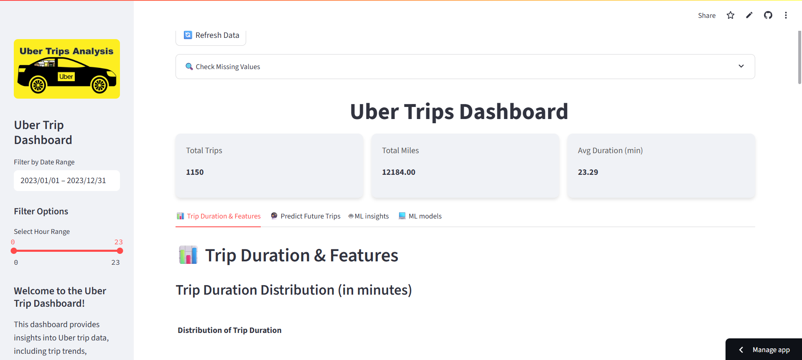
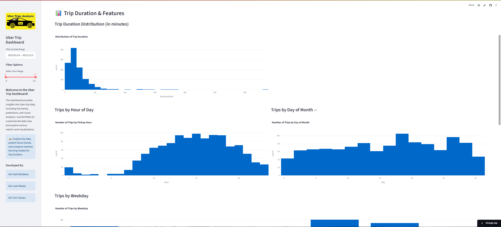
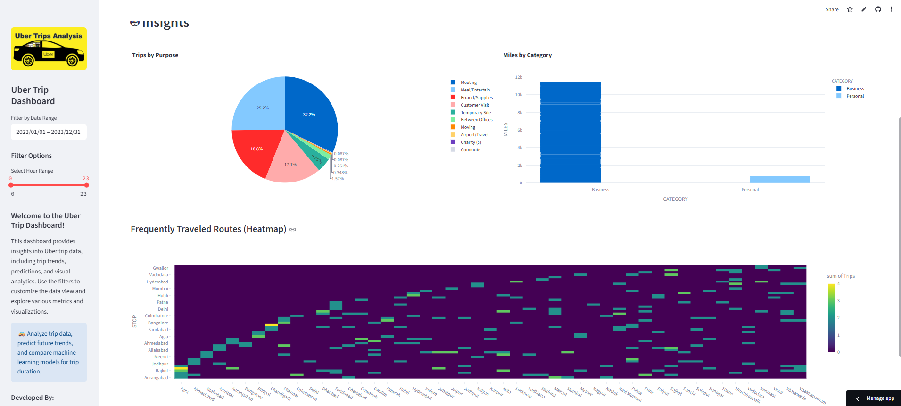
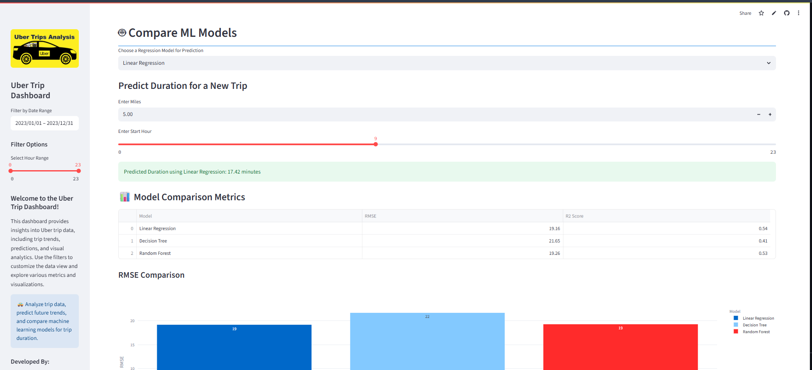

# 🚕 Uber Trip Analysis Dashboard

An interactive Streamlit dashboard for analyzing Uber trip data, visualizing patterns, predicting future demand using Facebook Prophet, and comparing multiple machine learning models for trip duration prediction.

---

## 📊 Features

- **Data Filtering** by date and hour
- **Missing Value Handling**
- **Interactive Visualizations** using Plotly
- **Trip Pattern Analysis**
- **Forecasting** using Facebook Prophet
- **Machine Learning Models** to predict trip duration:
  - Linear Regression
  - Decision Tree
  - Random Forest
- **Model Performance Metrics**: RMSE & R² Score comparison
- Clean, responsive UI using **custom HTML + CSS** in Streamlit

---

## 📁 Project Structure

```
📦 Uber-Trip-Analysis/
│
├── uber_dashboard.py         # Main Streamlit app
├── UberDataset_In1.csv       # Uber trip dataset
├── requirements.txt          # Python dependencies
└── README.md                 # Project documentation
```

---

## 🔧 Requirements

To run the app, install the dependencies:

```bash
pip install -r requirements.txt
```

### 🔒 Required Python Libraries

```txt
streamlit>=1.25.0
pandas
numpy
plotly
scikit-learn
prophet
matplotlib
altair
pydeck
```

---

## 🚀 Run the Dashboard Locally

1. Clone the repository:
   ```bash
   git clone https://github.com/SahiRB1104/Uber-Trip-Analysis.git
   cd Uber-Trip-Analysis
   ```

2. Create and activate a virtual environment (optional but recommended):
   ```bash
   python -m venv venv
   source venv/bin/activate  # or .\venv\Scripts\activate on Windows
   ```

3. Install dependencies:
   ```bash
   pip install -r requirements.txt
   ```

4. Run the Streamlit app:
   ```bash
   streamlit run uber_dashboard.py
   ```

---

## 🌐 Live Demo

Access the live app here: [Streamlit Dashboard](uber-trip-analysis-99v4g3r8x4yvupvbjnasoq.streamlit.app)

---

## 📸 Screenshot





---

## 👨‍💻 Developed By

- Sahil Bhalekar 
- Jash Bheda 
- Om Chavan 

---

## 📝 License

MIT License – feel free to use, modify, and distribute.

---

## 💡 Future Improvements

- Geolocation map-based analysis
- Outlier detection for duration
- Cluster analysis on routes
- Realtime integration with Uber APIs (if available)
